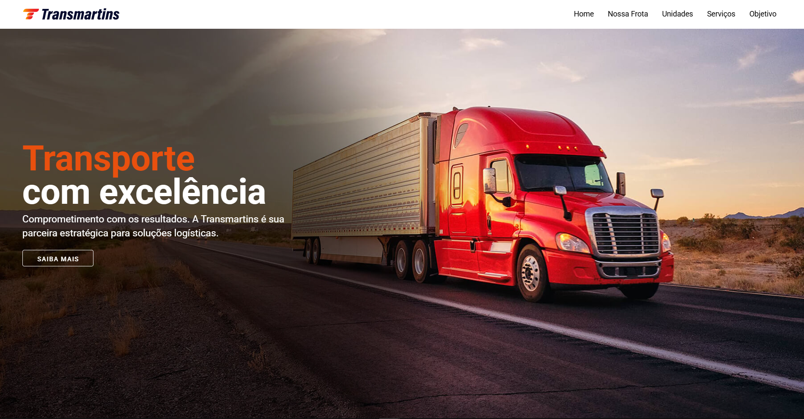

<div align="center">
  
  

</div>

<h1 align="center">
  💻<br>Transmartins -  Pablo Santos
</h1>



<h4 align="center"><a href="https://transmartins-vue.vercel.app/">Clique para visitar o site</a></h4>

## 🌳 Projeto
A Transmartins é uma empresa conta com uma frota moderna e diversificada, além de ser uma agência profissional de logística e cargas, visando sempre oferecer qualidade e segurança nos serviços prestados.


## 👨🏽‍💻 Tecnologias utilizadas
Para o desenvolvimento da Transmartins usarei as seguintes tecnologias:
  - Visual Studio Code;
  - Vue.js ;
  - Vuetify;
  - Vite;

## 🛠️ Como Rodar o Projeto

1. Clonar o Repositório
```bash
  git clone https://github.com/Pablo-M-Santos/Transmartins-Vue.git
```

2. Instalar as Dependências
Certifique-se de ter o Node.js instalado em sua máquina.
```bash
  npm install
```

4. Rodar o projeto Localmente
```bash
  npm run dev
```
 > O frontend estará disponível em http://localhost:3000


